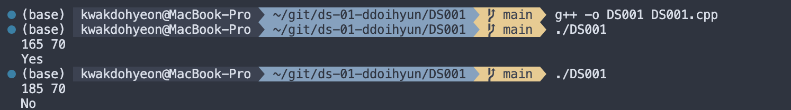
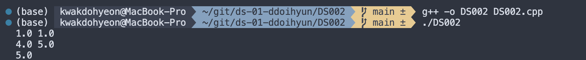
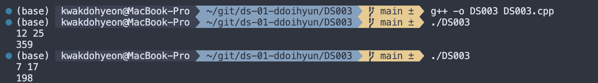
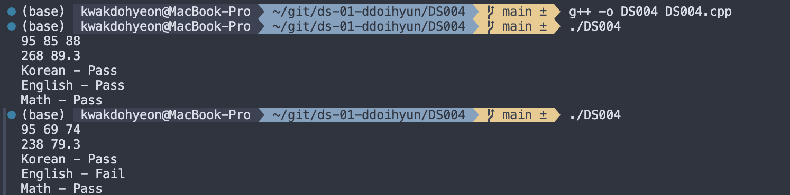
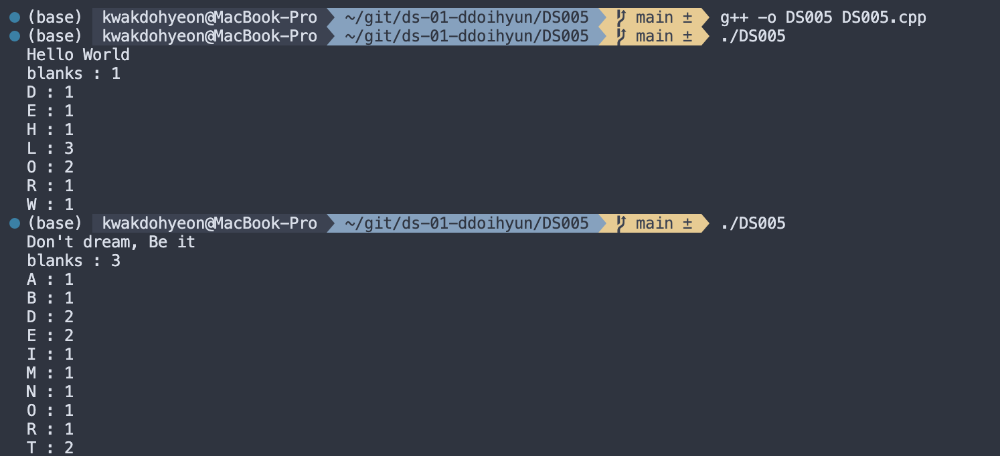
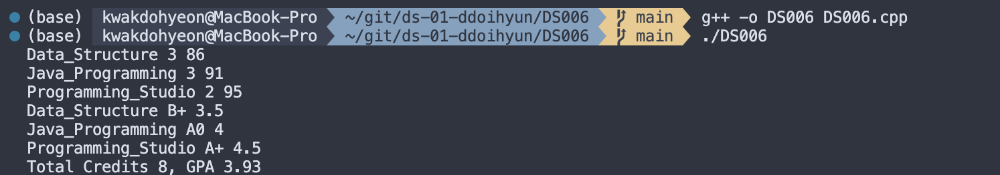
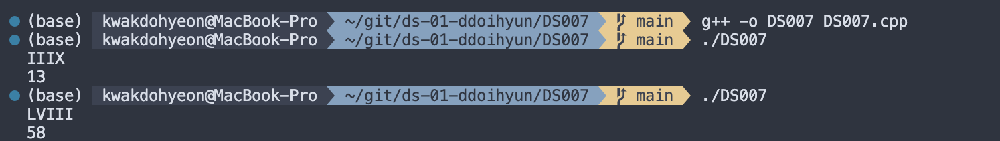
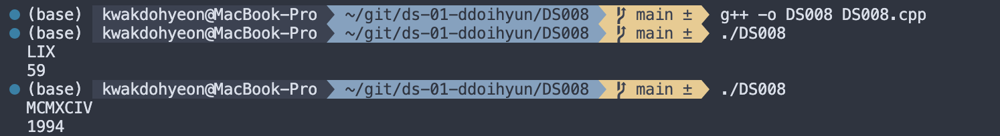
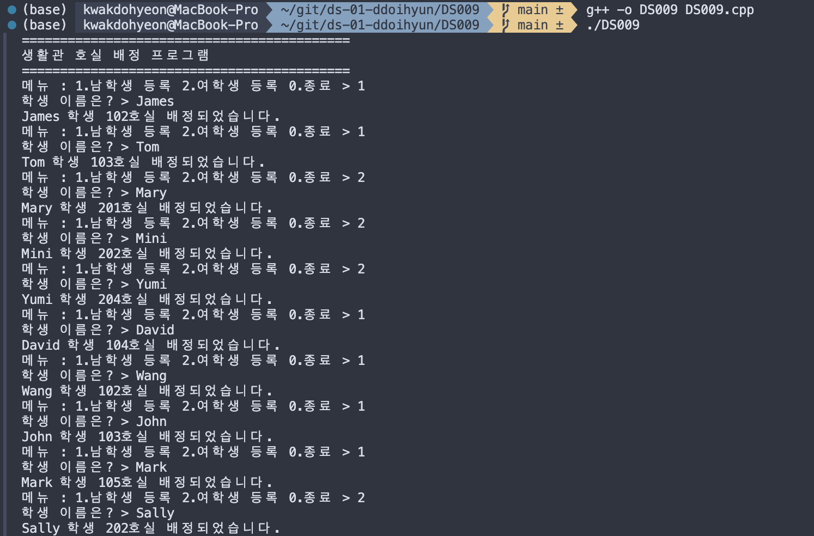
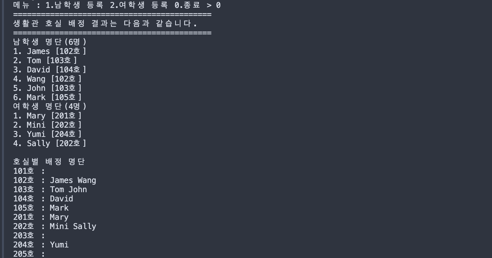

# 프로그래밍 스튜디오 DS/C++ Lab 01

### DS/C++ Lab#1 - Console Input & Output (iostream)
- DS001. 비만 판정하기
  

- DS002. 좌표 2개를 입력받은 후 좌표간 거리 계산
  

- DS003. 날짜(월, 일)를 입력받아 1년 중 몇 번째 날인지 계산
  

- DS004. 국, 영, 수 과목 점수를 입력받아 총점과 평균을 계산하고, 등급 판정
  

- DS005. 알파벳 개수 세기
  

- DS006. 전공 3과목의 GPA 계산하기
  

- DS006. 전공 3과목의 GPA 계산하기
  

- DS007. 문장을 숫자로 변환하기 (버전1)
  

- DS008. 문장을 숫자로 변환하기 (버전2)
  

- DS009. 생활관 호실 배정 프로그램
  
  