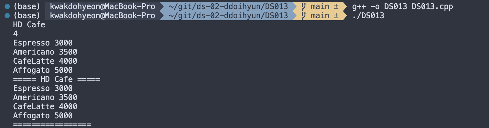

# 프로그래밍 스튜디오 DS/C++ Lab 02

### DS/C++ Lab#2 - Array & Pointer
- DS011. 입력한 수의 전체 합과 최대값 구하기
  

- DS012. 구조체 비교하기
  

- DS013. 카페 메뉴 관리하기
  

- DS014. 문장의 앞뒤 공백 제거하기
  

- DS015. 마지막 단어의 길이 구하기
  

- DS016. prefix 문자열 구하기
  