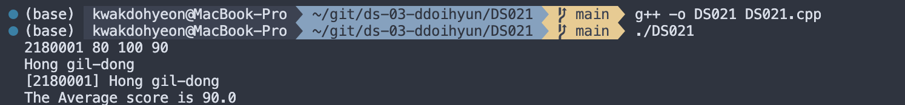
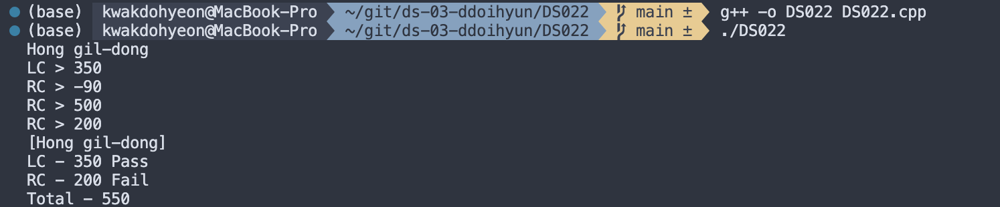
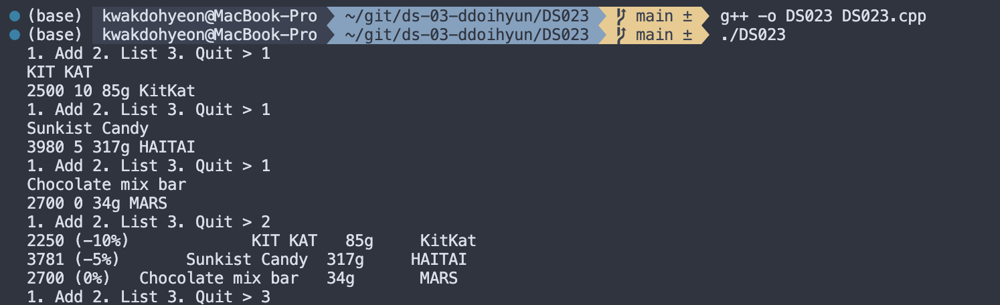
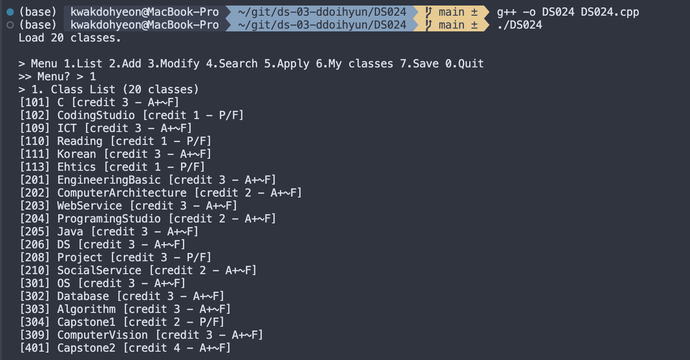
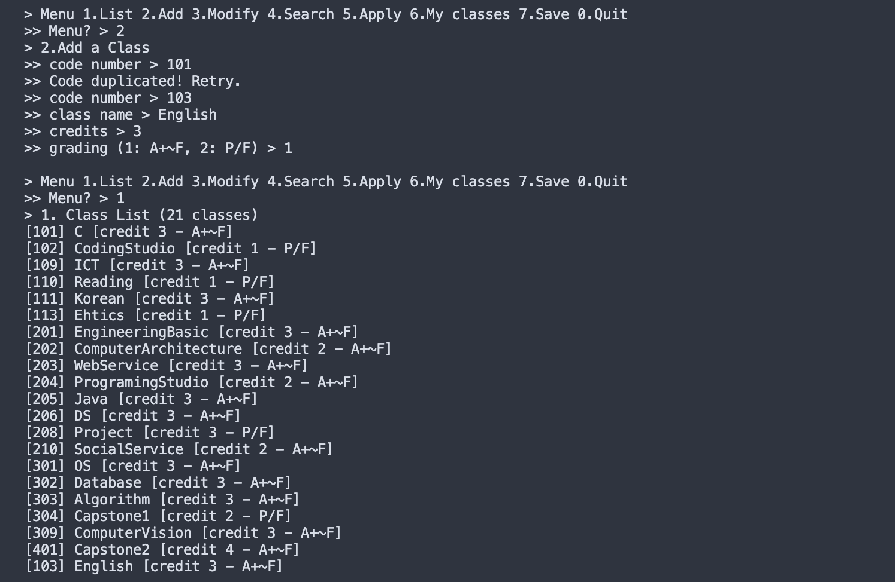
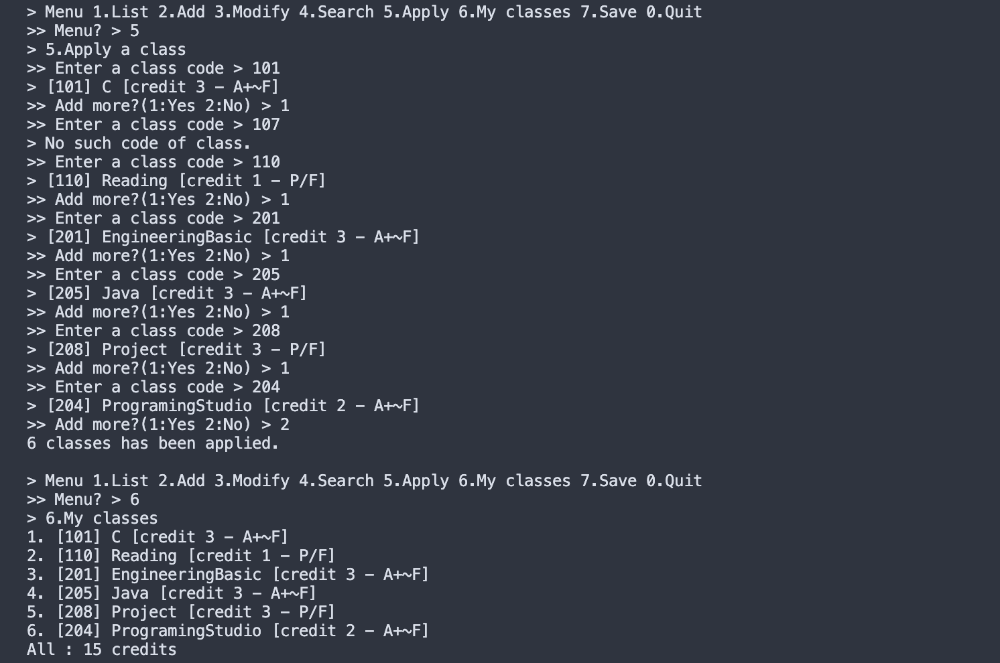
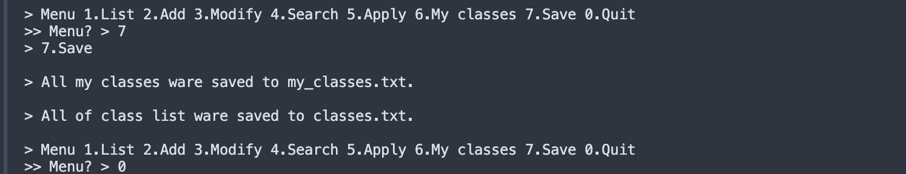
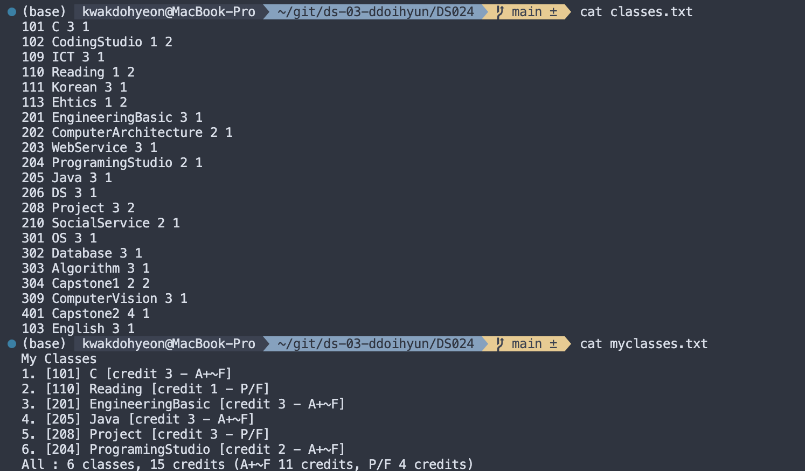

# 프로그래밍 스튜디오 DS/C++ Lab 03
22200034 / 곽도현

### DS/C++ Lab#3 - Console Input & Output
- DS021. 성적 계산하기
  

- DS022. 졸업 영어성적 판단하기
  

- DS023. 쇼핑몰 상품 정보 관리
  

- DS024. 수강 신청 프로그램 (C++ 버전)
  
  
  
  
  