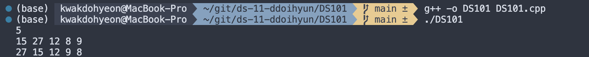
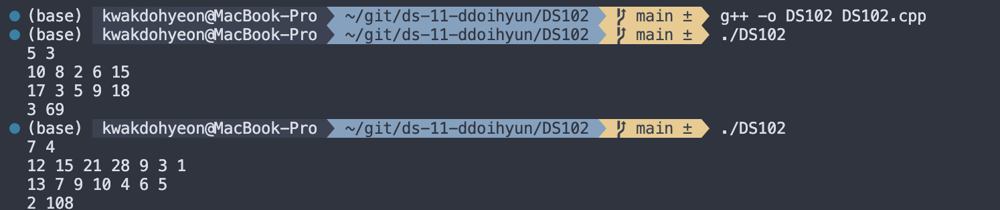
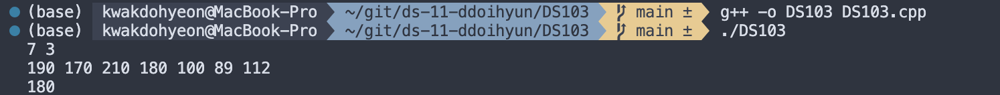
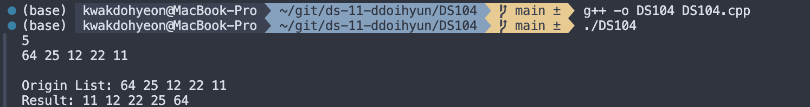
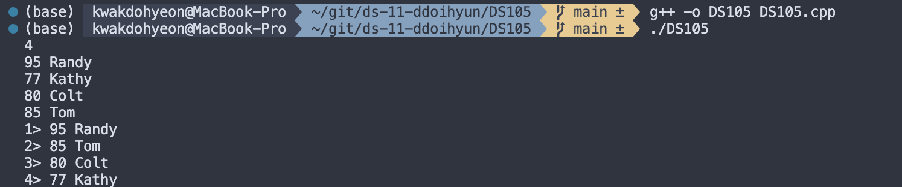

# 프로그래밍 스튜디오 DS/C++ Lab 11
22200034 / 곽도현

### DS/C++ Lab#11 - Coding Test
- DS101. Sort machine
  

- DS102. 최댓값을 만들자.
  

- DS103. 상 받는 최소 점수는?
  

- DS104. Sorting with linked list (ver.1)
  

- DS105. Sorting with linked list (ver.2)
  