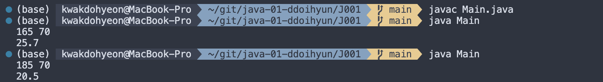
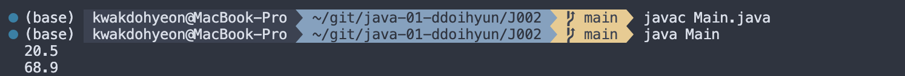
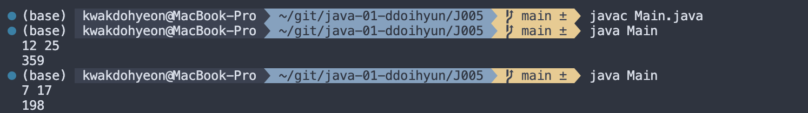

# 프로그래밍 스튜디오 Java Lab 01
22200034 / 곽도현

### Java Lab#1 - Console Input & Output
- J001. 키와 몸무게로 비만도(BMI) 계산
  

- J002. 섭씨 온도를 화씨온도로 변환
  

- J003. 아파트의 제곱미터 수치를 평형으로 바꾸기
  

- J004. 좌표 2개를 입력받은 후 좌표간 거리 계산
  

- J005. 날짜(월, 일)를 입력받아 1년 중 몇 번째 날인지 계산
  