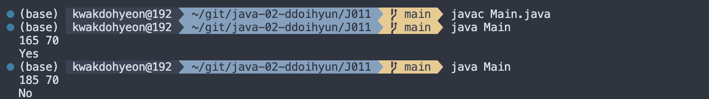
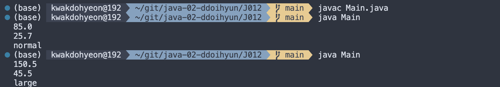
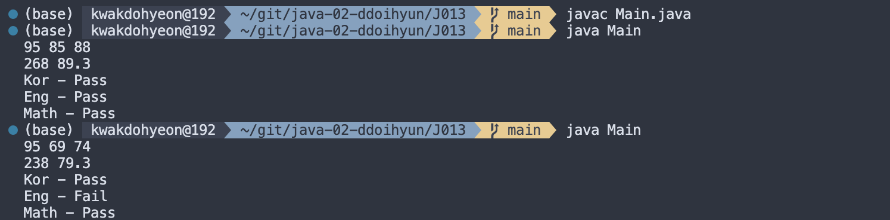
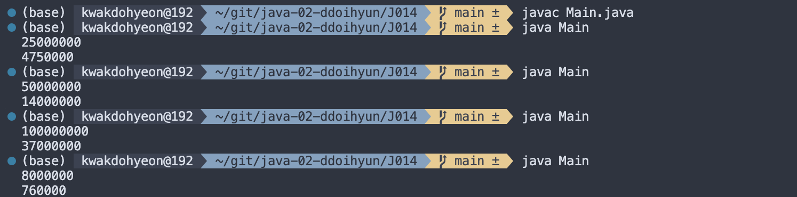
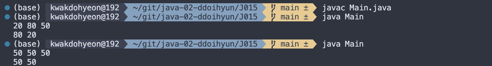

# 프로그래밍 스튜디오 Java Lab 02

### Java Lab#2 - Condition
- J011. 비만 판정하기
  

- J012. 아파트 평형 계산 및 종류 판정
  

- J013. 국, 영, 수 과목 점수를 입력받아 총점과 평균을 계산하고, 등급 판정
  

- J014. 연봉을 입력받아 소득세 계산
  

- J015. 3개의 수 중 최댓값과 최솟값 구하기
  