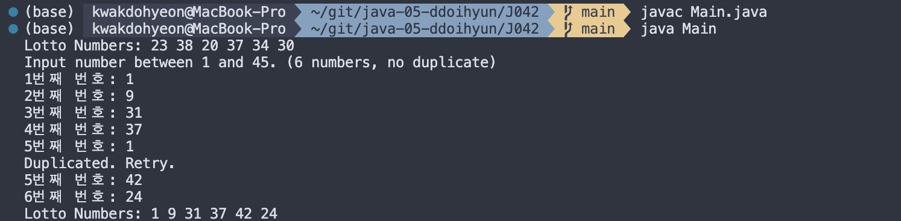
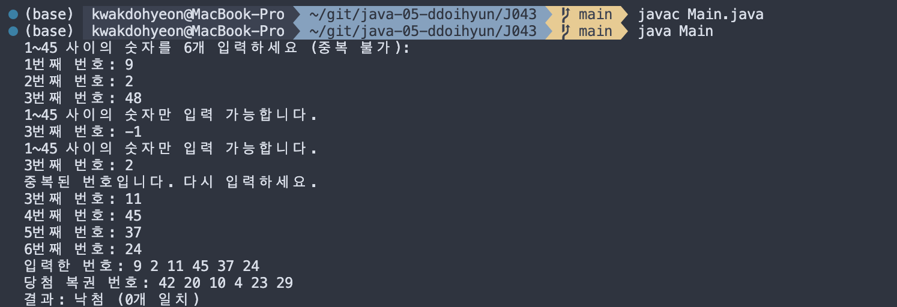
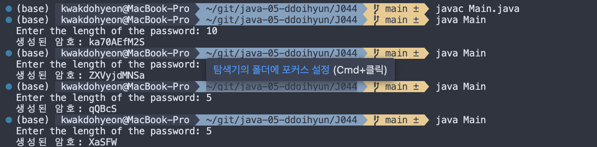
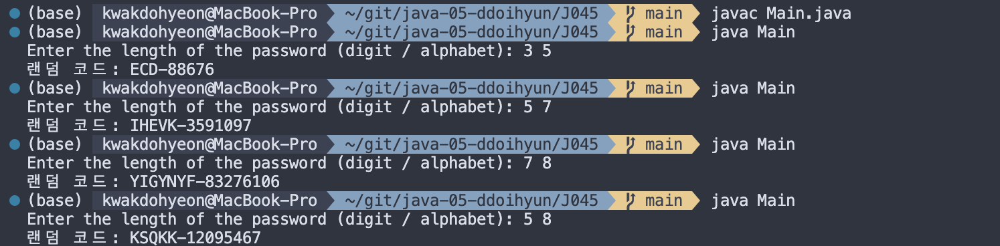
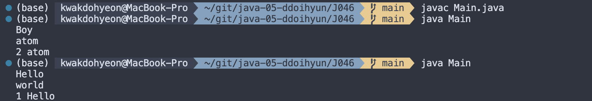
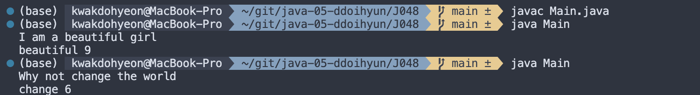

# 프로그래밍 스튜디오 Java Lab 05

### Java Lab#5 - Class & Methods
- J041. 로또 번호 만들기
  

- J042. 로또 번호 입력하기
  

- J043. 로또 번호 당첨 확인하기
  

- J044. Random Password 만들기
  

- J045. 랜덤 코드 만들기
  

- J046. 문자열을 다루는 유틸리티 클래스 제작하기 - 1
  

- J047. 문자열을 다루는 유틸리티 클래스 제작하기 - 2
  

- J048. 문자열을 다루는 유틸리티 클래스 제작하기 - 3
  