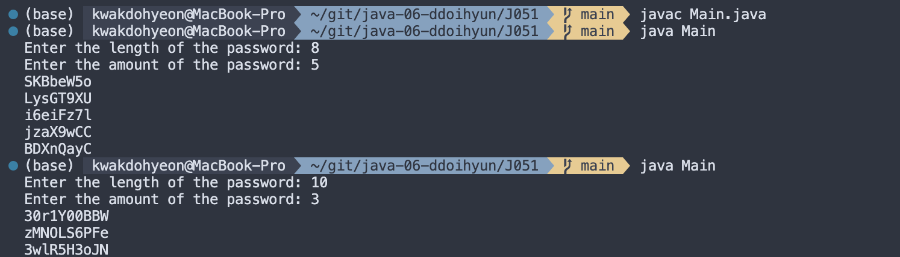
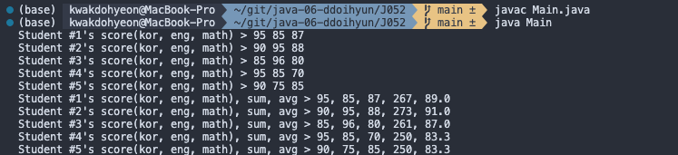
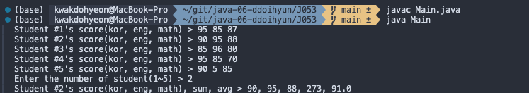
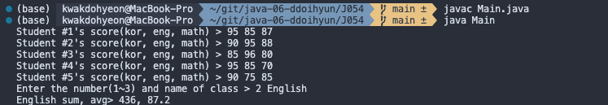
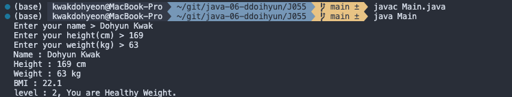

# 프로그래밍 스튜디오 Java Lab 06
22200034 / 곽도현

### Java Lab#6 - Console Input & Output
- J051. 여러 개의 암호 문자열 만들기
  

- J052. 국영수 점수 분석하기 - 1
  

- J053. 국영수 점수 분석하기 - 2
  

- J054. 국영수 점수 분석하기 - 3
  

- J055. 비만도 계산하기
  