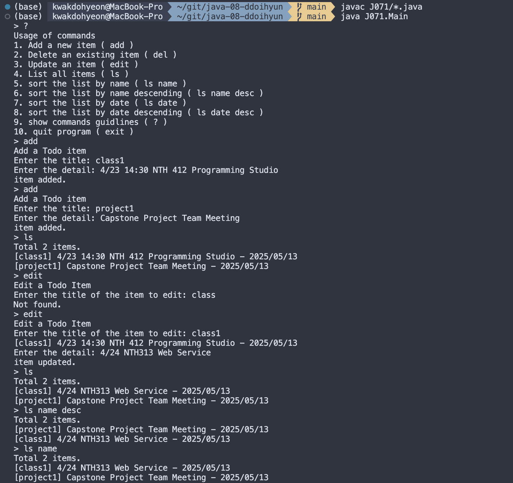
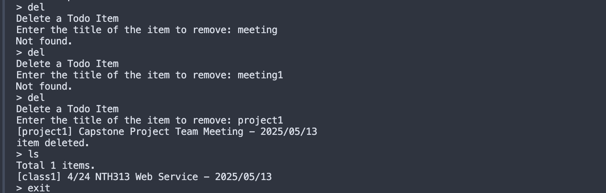
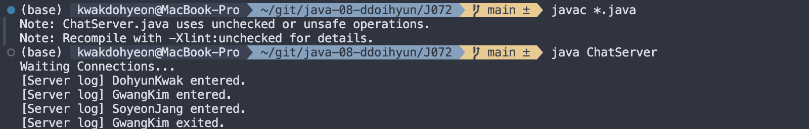
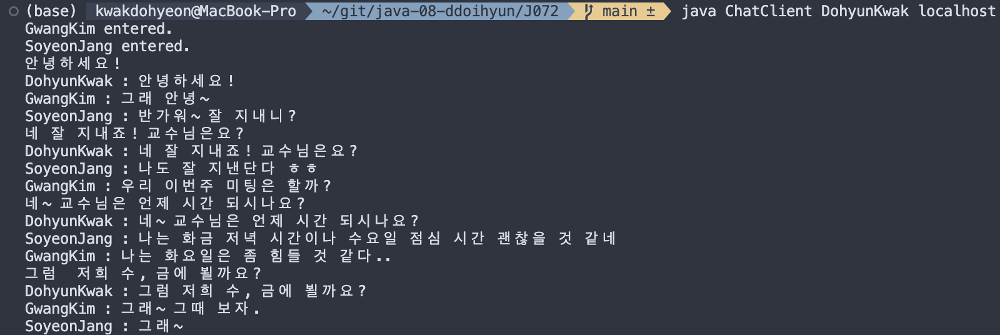
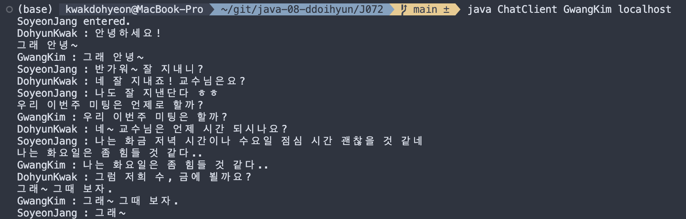
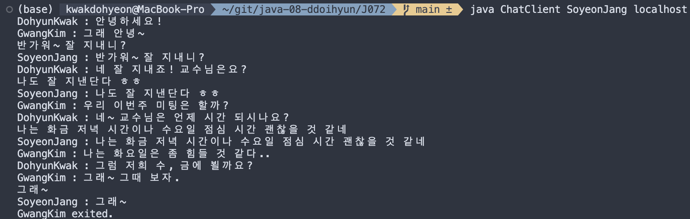

# 프로그래밍 스튜디오 Java Lab 08
22200034 / 곽도현

### Java Lab#8 - Console Input & Output
- J071. 일정 관리 프로그램 ver.2
  
  

- J072. 간단한 채팅 프로그램 분석 및 실행하기
  
  ChatServer
  
  ChatClient_DohyunKwak
  
  ChatClient_GwangKim
  
  ChatClient_SoyeonJang

  J072번 문제의 코드는 서버에 소켓을 통해 연결하여 사용자(ChatClient)로부터 입력을 받아 서버로 전송하고, 서버에서 전송한 메시지를 별도의 '스레드(Thread)'에서 출력하는 코드이다. 이로써 간단한 채팅 프로그램을 구현할 수 있다.
- ChatServer.java: 
  서버 측 프로그램으로, 클라이언트의 연결을 수락하고 받은 메시지를 모든 클라이언트에게 브로드캐스트.
- ChatClient.java: 
  클라이언트 측 프로그램으로, 사용자 입력을 서버로 전송하고 서버로부터 받은 메시지를 출력.