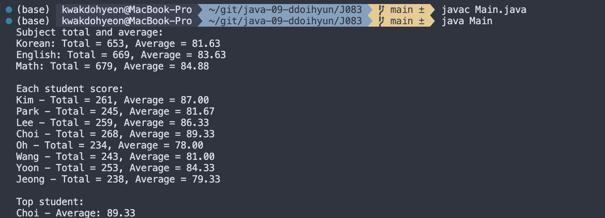
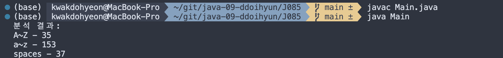

# 프로그래밍 스튜디오 Java Lab 09

### Java Lab#9 - File I/O
- J081. 최댓값과 최솟값 구하기 (파일버전)
  

- J082. 비만인 사람 비율 알아내기 (파일 버전)
  

- J083. 국영수 점수 분석하기 (파일 버전)
  

- J084. 학부 영문이름 중 가장 긴 이름 찾기
  

- J085. 텍스트 파일 내의 알파벳(대소문자별)의 개수와 빈칸의 개수 구하기
  