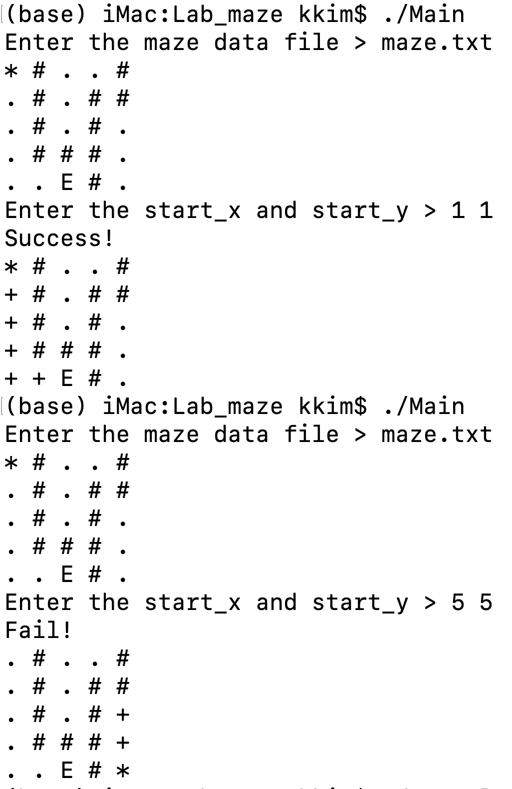
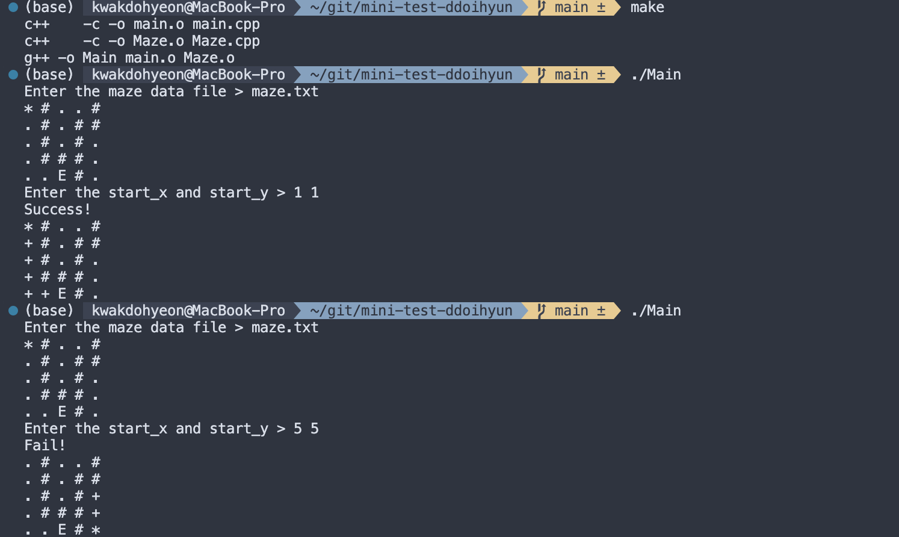

# 2025 Programming Studio Mini Test
1. 학번: 222000034
2. 이름: 곽도현

## New features
- Maze.cpp 완성 과정 기술

소스 파일에 주석 처리하여 기술하였습니다.

- main.cpp에서 새롭게 추가된 내용 기술

시작점을 랜덤으로 생성하려 했으나, srand()의 문법이 기억나지 않았고 시간 부족으로 완성하지 못했습니다.

## screen captures
- Sample

- Screen1 (maze.txt)

